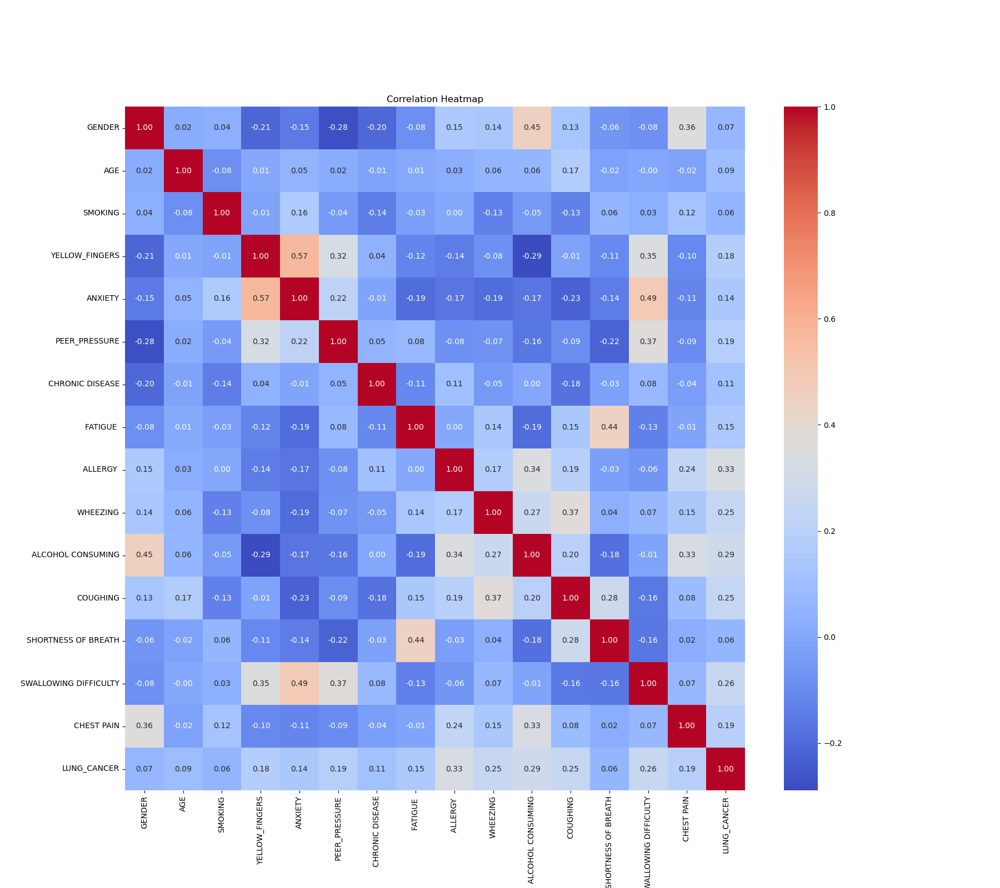
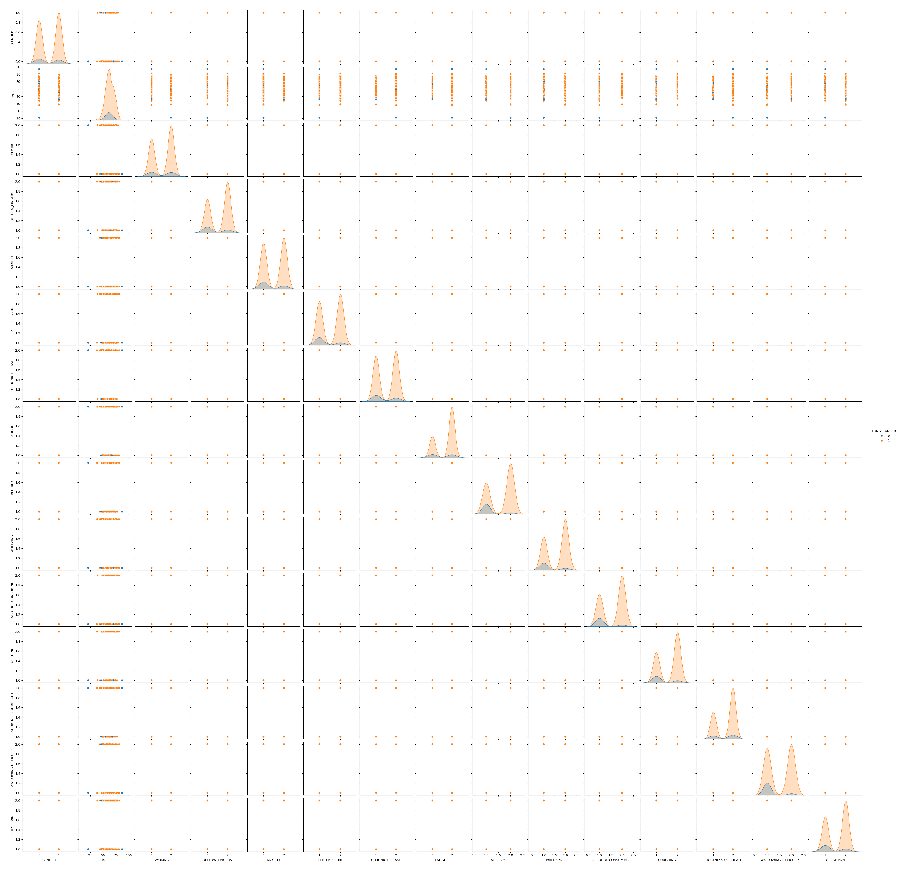
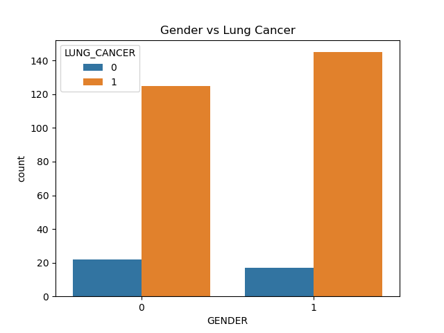

# 🫁 Lung Cancer Prediction App


## 🔍 Project Overview

This project is a **Machine Learning-powered web app** that predicts the likelihood of **lung cancer** in patients based on their health metrics and lifestyle choices. The app uses a trained classification model and is deployed using **Streamlit** for easy access and usage.

## 📂 Dataset

- Source: [Kaggle - Lung Cancer Data](https://www.kaggle.com/datasets/iamtanmayshukla/lung-cancer-data)
- Features include:  
  `GENDER`, `AGE`, `SMOKING`, `YELLOW_FINGERS`, `ANXIETY`, `PEER_PRESSURE`,  
  `CHRONIC DISEASE`, `FATIGUE`, `ALLERGY`, `WHEEZING`, `ALCOHOL CONSUMING`,  
  `COUGHING`, `SHORTNESS OF BREATH`, `SWALLOWING DIFFICULTY`, `CHEST PAIN`, `LUNG_CANCER`

## ✅ Project Workflow

### 1. 📊 Data Preprocessing
- Label encoding for categorical features
- Feature scaling using `StandardScaler`

## 📈 Exploratory Data Analysis (EDA)

### 🔥 Correlation Heatmap



This heatmap shows the correlation between various features in the dataset.

### 📊 Distribution Plots


This histogram illustrates the distribution of ages in the dataset.



This pairplot visualizes relationships between selected features.

### ⚖️ Class Balance



This count plot shows the distribution of the target variable, indicating class balance.


### 3. 🤖 Model Training
- Models used:
- Logistic Regression
- Decision Tree Classifier
- Random Forest Classifier
- Support Vector Machine (SVM)
- Evaluation Metrics:
- Accuracy, Precision, Recall, F1-Score
- Confusion Matrix, ROC Curve

### 4. 🧠 Best Model Selection
- Random Forest achieved the best performance on the validation set

### 5. 🚀 Streamlit Deployment
- A web-based dashboard allows users to input details and get a lung cancer risk prediction instantly

---

## 🌐 How to Use

### 🔧 Clone the repo
```bash
git clone https://github.com/MdAjams/Predict_Lung_cancer
cd Predict_Lung_cancer

```

## 📦 Install dependencies
```pip install -r requirements.txt```

## ▶️ Run the app
```streamlit run main.py```

## 🧠 Insights
- Smoking is a major factor associated with lung cancer.
- Older individuals have a higher risk.
- Male patients show slightly higher cancer incidence in the dataset.


## 🛠️ Tech Stack
Frontend: Streamlit
Backend: Scikit-Learn, Pandas, NumPy
Visualization: Seaborn, Matplotlib
Deployment: Localhost / Streamlit Cloud.

## ✨ **Author**  
Md Ajam  
[GitHub](https://github.com/MdAjams) | [LinkedIn](https://www.linkedin.com/in/mdajam/)


